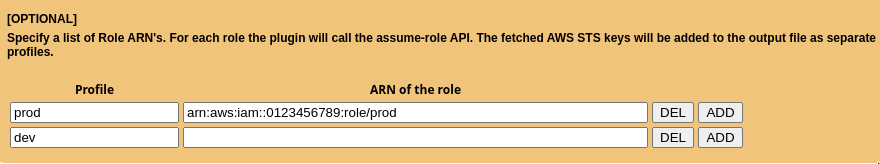

# SAML to AWS STS Keys Conversion
Google Chrome Extension which converts a SAML 2.0 assertion to AWS STS Keys (temporary credentials). Just log in to the AWS Web Management Console using your SAML IDP and the Chrome Extension will fetch the SAML Assertion from the HTTP request. The SAML Assertion is then used to call the assumeRoleWithSAML API to create the temporary credentials. (AccessKeyId, SecretAccessKey and SessionToken).

The Chrome Extension can be downloaded here:
[Google Chrome Web Store](https://chrome.google.com/webstore/detail/ekniobabpcnfjgfbphhcolcinmnbehde/)

# Table of Contents
* [Why this Chrome Extension?](#why)
* [Getting Started](#gettingstarted)
* [Create a symlink to your .aws directory (for Windows users)](#symlink)
* [Frequently Asked Question](#faq)

## Why this Chrome Extension?
If you don't have any user administration setup within AWS Identity & Access Management (IAM) but instead rely on your corporate user directory, i.e. Microsoft Active Directory. Your company uses a SAML 2.0 Identity Provider (IDP) to log in to the AWS Web Management Console (Single Sign On). Then this Chrome Estension if for you!

You run into trouble as soon as you would like to execute some fancy scripts from your computer which calls the AWS API's. When sending a request to the AWS API's you need credentials, meaning an AccessKey and SecretKey. You can easily generate these keys for each user in AWS IAM. However, since you don't have any users in AWS IAM and don't want to create users just for the sake of having an AccessKey and SecretKey you are screwed. But there is a way to get temporary credentials specifically for your corporate identity.

The Security Token Service (STS) from AWS provides an API action assumeRoleWithSAML. Using the SAML Assertion given by your IDP the Chrome Extension will call this API action to fetch temporary credentials. (AccessKeyId, SecretAccessKey and SessionToken). This way there is no need to create some sort of anonymous user in AWS IAM used for executing scripts. This would be a real security nightmare, since it won't be possible to audit who did what. This Chrome Extension however will make it super easy for you to just use your corporate identity for executing scripts calling AWS API's.

## Getting Started

1. Install the extension
2. Login to the AWS console using your SAMLv2 SSO link. A file name `crendentials` should be automatically downloaded 
3. You can now use that `credentials` file just like your regular `~/.aws/credentials` file, or use it as an environment variable : `$ AWS_SHARED_CREDENTIALS_FILE=~/Downloads/credentials aws sts get-caller-identity`

4. If you require to switch role to ultimately access your useful tokens, this extension can pre-populate your `crentials` file too

## Create a symlink to your .aws directory (for Windows users)

A symbolic link (also called symlink) is a sort of shortcut that applications can use. You want to use a symlink for this extension because you don't want to copy-paste the `credentials` file each time you redownload it (i.e at least every few hours when then keys expires).

With a cmd as administrator, create a symlink : `mklink C:\Users\USERNAME\.aws\credentials C:\Users\USERNAME\Downloads\credentials`

## FAQ: Frequently Asked Question
1. Why can I not save file somewhere else?

TODO

2. How long are the credentials valid?

TODO

3. No file is downloading, why?

see [this answser](https://github.com/prolane/samltoawsstskeys/issues/33#issuecomment-576747562) for debugging instructions.
